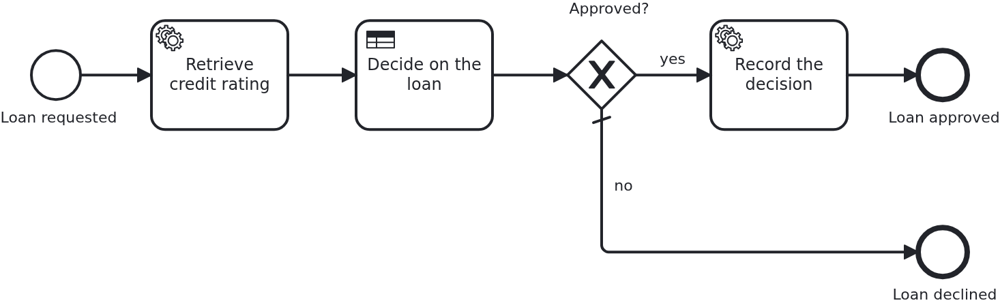

# Business rule task

[](./LICENSE)

A decision does not have to be Java. This blueprint takes the base blueprint and lets a DMN
decision table decide whether a loan is approved: the table is deployed with the process,
the BPMS evaluates it, and what it decided steers the model and reaches the application.

## What this blueprint shows



The loan approval of the base blueprint, with a business rule task after the service task.
The service task rates the request, the decision table turns the amount and that rating into
an approval, and what it produced is used twice: the gateway routes on it, and the task
behind the gateway hands it to the application.

What is worth looking at:

- The decision table lives next to the BPMN files, in `processes/<adapter-id>/`, and is
  deployed with them by the boot. Nothing deploys it separately, and no property switches it
  on. It is adapter-specific for the same reason a BPMN file is: how a business rule task
  names its decision is the engine's business.
- **No `@WorkflowTask` method serves the business rule task.** The engine evaluates the
  table; VanillaBP knows that and does not ask for a handler. This is the one BPMN task type
  where the wiring validation stays silent on purpose.
- What the decision produced is a variable of the workflow, so reading it needs nothing new:
  the task's input mapping brings it into the task's scope and `@TaskParam` names it
  (`WorkflowTaskHandler.recordDecision`). There is not one DMN-specific line of Java in this
  blueprint.
- **A decision can also work without any Java.** The gateway behind the business rule task
  reads the result straight from the workflow, and the declined branch ends the process
  without the application hearing about it. `LoanApprovalIT` runs both outcomes, and the
  declined one asserts that the aggregate stays untouched.
- The rules themselves are where a business person can read them. Changing when a loan is
  approved is a change to `loan_approval.dmn`, not to the application.

- The workflow module is a JAR of its own (`loan-approval/`) and is not deployed alone. It
  declares itself by the marker file `META-INF/workflow-module` containing its ID, and it
  builds an index of its classes (`jandex-maven-plugin`), which is how the application finds
  the code inside a dependency.
- Everything it owns is named after that ID. There is no classloader isolation between
  workflow modules, they share one classpath, so each module needs a namespace of its own in
  two places: a unique Java package (`blueprint.workflowmodule.loanapproval`) and a single
  resource subdirectory (`src/main/resources/loan-approval/`) holding *all* of its resources.
  The marker file is the one exception; it has to sit at `META-INF/`.
- It knows no BPMS. Its only VanillaBP dependency is `vanillabp-quarkus-support`, which
  deliberately exposes no engine API. The adapter is a dependency of the application
  (`application/`). BPMN files are the only thing that differs between engines, which is why
  they live in `processes/<adapter-id>/`.
- It brings its own configuration. `loan-approval/loan-approval.yaml` inside the module is
  loaded automatically and takes precedence over `application.yaml`. Configuration a module
  needs stays with the module instead of scattering across the project.
- One class per direction of the BPMN wiring. `Service` is the business code and never
  touches VanillaBP. `Workflow` is what the application tells the process and the only place
  `ProcessService` is injected. `WorkflowTaskHandler` is what the process tells the
  application: it carries `@WorkflowService` and every `@WorkflowTask` method and calls
  `Service`. Here each of them forwards a single line, which is exactly why it is worth
  seeing: the shape stays the same once a process needs messages correlated or tasks
  completed.
- Persisting the aggregate is a repository and nothing else. `AggregateRepository` is a
  Panache repository, and VanillaBP recognises it: it loads the aggregate before a task and
  saves it afterwards without a line of glue. The same holds for the other persistence
  patterns of this platform, and an application whose persistence fits none of them
  implements `AggregatePersistenceAware`, which always wins.
- It is tested on its own. The integration test lives in the workflow module and runs it;
  the application only carries a smoke test.

The application configures no `vanillabp.*` property at all: with one adapter on the
classpath and one workflow module, VanillaBP derives the adapter, the module and the
location of the BPMN files by convention.

## Running it

Requires a JDK 21. Camunda 7 is embedded, so nothing else has to run:

```bash
mvn install verify
```

Running it on another BPMS is a Maven profile, not one line of Java changes:

```bash
mvn install verify -Pcamunda8
```

Camunda 8 is a remote engine, so a cluster has to run and be pointed at. Start one, then add
its address to `application/src/main/resources/application.yaml` and to
`loan-approval/src/test/resources/application.yaml`:

```yaml
vanillabp:
  adapters:
    camunda8:
      rest-address: http://localhost:8080
      # Nothing else is needed: this adapter keeps workflow modules apart by nothing at all
      # ('name-clash-avoidance: none') unless told otherwise, because a cluster started from
      # the stock image has multi-tenancy switched off and rejects a tenant per module. The
      # adapter warns about it while booting - with one workflow module the identifiers are
      # unique anyway. Set 'name-clash-avoidance: use-prefix' to have VanillaBP prefix them.
```

Without it the application does not boot, and says so:

```
Camunda 8 adapter 'camunda8' is used but not configured: the property
'vanillabp.adapters.camunda8.rest-address' is missing.
```

That is the normal way to work with VanillaBP: configuration is validated while booting, and
the message names what to do.

Start the application:

```bash
mvn -pl application quarkus:dev
```

Nothing about identifiers shows up at startup: the BPMS profiles of this blueprint set
`name-clash-avoidance: use-prefix`, so VanillaBP puts the workflow module ID in front of every
identifier before it reaches the engine and takes it off again on the way back. The BPMN files,
the business code and the rest of the configuration keep the plain names, and no tenant is
involved, which matters on a BPMS licensed per tenant. What the modes are and what each of them
costs is in
[the wiki](https://github.com/vanillabp/adapter-platform-integration/wiki/Workflow-modules#how-name-clashes-are-avoided).

Start a loan approval. This is the only URL you need:

```
http://localhost:8080/api/loan-approval/start?amount=2000
```

It answers with the ID of the loan request and logs the URL showing the result:

```
Loan approval '0f7c…' started
Credit rating of loan approval '0f7c…' is 8
Loan approval '0f7c…' was decided: APPROVED
Show the result -> http://localhost:8080/api/loan-approval/0f7c…
```

Opening that URL shows the aggregate, including what the decision table decided.

Ask for more money and the same table declines it, which the log does not report at all,
the declined branch of the gateway ends the process without calling the application:

```
http://localhost:8080/api/loan-approval/start?amount=9000
```

## How it works

|                                          File                                          |                                              Role                                               |
|----------------------------------------------------------------------------------------|-------------------------------------------------------------------------------------------------|
| `loan-approval/src/main/resources/META-INF/workflow-module`                            | contains `loan-approval` and thereby declares this JAR to be a workflow module                  |
| `loan-approval/src/main/resources/loan-approval/processes/camunda7/loan_approval.bpmn` | the process: start event, service task, end event. The task names the method implementing it    |
| `.../loanapproval/model/Aggregate.java`                                                | the workflow aggregate, a normal JPA entity keyed by the loan request ID                        |
| `.../loanapproval/model/AggregateRepository.java`                                      | how that entity is stored and loaded, for the application and for VanillaBP                     |
| `.../loanapproval/Service.java`                                                        | the business code: builds the aggregate and tells `Workflow` that a loan was requested          |
| `.../loanapproval/Workflow.java`                                                       | what the application tells the process; the only class using `ProcessService`                   |
| `.../loanapproval/WorkflowTaskHandler.java`                                            | what the process tells the application: `@WorkflowService`, `@WorkflowTask`, calls `Service`    |
| `.../loanapproval/ApiController.java`                                                  | the GET endpoints operating the process                                                         |
| `.../loanapproval/config/LoanApprovalProperties.java`                                  | the module's own configuration                                                                  |
| `application/src/main/resources/application.yaml`                                      | the database, and nothing about the workflow                                                    |
| `loan-approval/src/test/.../LoanApprovalIT.java`                                       | starts a real workflow and waits for the aggregate to have been filled                          |
| `loan-approval/src/test/.../WorkflowModuleTest.java`                                   | the base class it inherits from: waiting for workflow progress, identical in every blueprint    |
| `loan-approval/src/test/resources/application.yaml`                                    | the database of the module's own test                                                           |
| `application/src/test/.../ApplicationSmokeTest.java`                                   | boots the application, which is where VanillaBP validates that every BPMN task is wired to code |

The order of events: `ApiController` calls `Service#initiateLoanApproval`, which builds the
aggregate and tells `Workflow` what happened, namely `loanRequested`, not "start the
process". `Workflow#loanRequested` calls `ProcessService#startWorkflow`, and VanillaBP
persists the aggregate and starts the process in the same transaction, so an aggregate
without a workflow, or the other way round, cannot happen. The BPMS then reaches the service
task and calls `WorkflowTaskHandler#retrieveCreditRating`, which does nothing but hand over
to `Service#assessCreditRating`, with the aggregate loaded before and saved after the call.
That happens in a transaction VanillaBP owns, which is why neither of the two classes
declares one of its own. Only the methods the API calls do, since starting a workflow has to
run in a transaction and so does reading an entity. Putting `@Transactional` on a task
handler anyway fails the boot with a message naming the method, and putting it on a bean the
handler calls fails the task while it runs, so this is a rule VanillaBP enforces rather than
one to remember.

Where the BPMN files are read from is a convention on both sides of the split: in the
application this module is a dependency, so its models are looked for below its ID, and in its
own test the module is the artifact being run, where VanillaBP looks below the ID as well
before it looks at the root. Neither the module nor its test configures a location.

That the test waits instead of asserting immediately is not accidental: a BPMS runs tasks in
its own transactions, and a remote one does so eventually. A test assuming otherwise passes
on one engine and fails on the next.

## Documentation

- [Workflow modules](https://github.com/vanillabp/adapter-platform-integration/wiki/Workflow-modules): what a workflow module is, its ID, and where its BPMN files are looked for
- [Defining a workflow module](https://github.com/vanillabp/adapter-platform-integration/wiki/Workflow-modules-in-Quarkus#defining-a-workflow-module): the marker file, the index, resource conventions and the module's own configuration files
- [How name clashes are avoided](https://github.com/vanillabp/adapter-platform-integration/wiki/Workflow-modules#how-name-clashes-are-avoided): what the warning at startup is about, and the modes keeping two workflow modules apart
- [Workflow aggregates](https://github.com/vanillabp/adapter-platform-integration/wiki/Workflow-aggregates): why there are no process variables, and how an application says where its aggregate is stored
- [Wire up a process / Wire up a task](https://github.com/vanillabp/spi-for-java#usage): the annotations used in `WorkflowTaskHandler.java`
- the wiki of the [BPMS adapter](https://github.com/vanillabp/adapter-platform-integration/wiki/BPMS-adapters) you use: how a BPMN task has to be modelled for that engine

This blueprint is developed in the monorepo
[`blueprints`](https://github.com/vanillabp-blueprints/blueprints). This repository is a
read-only mirror, **issues and pull requests belong there.**

## Noteworthy & Contributors

[VanillaBP](https://www.github.com/vanillabp/spi-for-java) was developed by [Phactum](https://www.phactum.at) with the
intention of giving back to the community as it has benefited the community in the past.


## License

Copyright 2026 Phactum Softwareentwicklung GmbH

Licensed under the Apache License, Version 2.0
